### MORTALITY RATES IN AFRICA
This project is about uncovering trends and other insights in health records sourced from World Health Organization.  
As infant, child, and maternal mortality rates continue to bedevil Africa, we hope to uncover trends  
in health records, and profer viable solutions to the problems that health data holds.

### DATA UNDERSTANDING

The columns in the original datasets contain health-related indicators and demographic information used in global health datasets like those from the **World Health Organization (WHO)** about all countries, regions, and locations of the world.  
However, the dataframe 'dn' presents the same information but limited to African countries only because the focus of this project is on Africa.  
Here is a brief description of each column:

#### **Entity**  
   - This refers to the name of the country or region in the dataset. It represents the geographical or political entity where the data is collected from (e.g., "Algeria", "Rwanda", "Nigeria").

#### **Code**  
   - This is likely a unique identifier or code for each country or region in the dataset (e.g., a country code like "USA" for the United States or "IN" for India). It is used for referencing the entity more efficiently.

#### **Year**  
   - This column indicates the year in which the data was collected or reported (e.g., "2020", "2021"). This is important for time series analysis to track changes over time.

#### **Births attended by skilled health staff (% of total)**  
   - This percentage represents the proportion of births in a specific country or region that are attended by skilled health personnel (doctors, nurses, midwives) during delivery. It is an important indicator of maternal health services. For the purpose of this project, the column was renamed as 'Births attended'.  

#### **Observation value - Indicator: Under-five mortality rate - Sex: Total - Wealth quintile: Total - Unit of measure: Deaths per 100 live births**  
   - This indicator shows the under-five mortality rate, which is the probability of a child dying before reaching the age of five, per 100 live births. It is an important health metric used to measure child health and development. The column also suggests that this is a general estimate for all sexes and wealth quintiles.
It was renamed as 'Under five mortality (per 100 live births)' for this project.  

#### **Cause of Death**  
   - This column indicates the specific cause of death (e.g., "Malaria", "Pneumonia", "Heart Disease") for which the data is being reported. This can be used for analyzing the leading causes of death in different regions or populations.

#### Immunization Indicators  
   These columns contain the percentage of one-year-olds who are vaccinated with specific vaccines:

   - **BCG (% of one-year-olds immunized)**:  
     Percentage of one-year-olds immunized with the **Bacillus Calmette-Guérin (BCG)** vaccine, which is primarily used to protect against tuberculosis (TB).
   
   - **HepB3 (% of one-year-olds immunized)**:  
     Percentage of one-year-olds immunized with the third dose of the **Hepatitis B** vaccine, which prevents Hepatitis B infection.

   - **Hib3 (% of one-year-olds immunized)**:  
     Percentage of one-year-olds immunized with the third dose of the **Haemophilus influenzae type b (Hib)** vaccine, which helps prevent infections like meningitis and pneumonia.

   - **IPV1 (% of one-year-olds immunized)**:  
     Percentage of one-year-olds immunized with the first dose of the **Inactivated Polio Vaccine (IPV)** to prevent polio.

   - **MCV1 (% of one-year-olds immunized)**:  
     Percentage of one-year-olds immunized with the first dose of the **Measles Containing Vaccine (MCV1)**, which is important for measles prevention.

   - **PCV3 (% of one-year-olds immunized)**:  
     Percentage of one-year-olds immunized with the third dose of the **Pneumococcal Conjugate Vaccine (PCV3)**, which helps prevent pneumonia, meningitis, and other infections caused by Streptococcus pneumoniae.

   - **Pol3 (% of one-year-olds immunized)**:  
     Percentage of one-year-olds immunized with the third dose of the **Polio** vaccine, which protects against polio virus infection.

   - **RCV1 (% of one-year-olds immunized)**:  
     Percentage of one-year-olds immunized with the first dose of the **Rotavirus vaccine (RCV1)**, which prevents severe diarrhea caused by rotavirus.

   - **RotaC (% of one-year-olds immunized)**:  
     Percentage of one-year-olds immunized with a **rotavirus vaccine**. This is sometimes denoted as **RotaC** for a particular version of the vaccine.

   - **YFV (% of one-year-olds immunized)**:  
     Percentage of one-year-olds immunized with the **Yellow Fever Vaccine (YFV)**, which is essential in regions with risk for yellow fever transmission.

   - **DTP3 (% of one-year-olds immunized)**:  
     Percentage of one-year-olds immunized with the third dose of the **Diphtheria, Tetanus, and Pertussis (DTP3)** vaccine. This vaccine prevents these three serious diseases.

### **Share of population covered by health insurance (ILO (2014))**  
   - This percentage represents the proportion of the population in a given country or region that is covered by **health insurance**, based on data from the **International Labour Organization (ILO)** in 2014. It provides insights into access to healthcare services and social protection.

### **Deaths - Sex: all - Age: 0 - Variant: estimates**  
   - This column contains the estimated number of **deaths among all sexes for individuals aged 0** (i.e., infant and child mortality) based on available data. This measure is often used to assess child mortality trends.

### **Estimated maternal deaths**  
   - This represents the estimated number of **maternal deaths**, typically defined as deaths resulting from complications during pregnancy, childbirth, or within a certain period after childbirth. This indicator is crucial for assessing maternal health and the quality of healthcare available to women during pregnancy and childbirth.

### **959828-annotations**  
   - This column contains special annotations/metadata associated with the dataset, such as notes, comments, additional references. This column was dropped as it didn't hold useful information that could guide this project.

### **Under-fifteen mortality rate**  
   - This represents the **under-fifteen mortality rate**, which is the number of deaths of children under 15 years of age per 1,000 live births. This is another key indicator of child health and overall health system effectiveness.

### DATA PRE-PROCESSING
The various datasets were loaded and subset for African countries after importing the various dependencies needed for data wrangling. It is important to note that duplicated records were found and dropped while cleaning each dataset. After data cleaning was done, the individual dataframes were all concatenated into one dataframe.  
A summary of the dataframe column names, number of records per column, each column datatype and a few more information were brought up using the '.info()' method. The '.describe()' method was transposed in order to give a better view of the summary statistics related to all numeric columns in the dataframe.  
A check for missing values was conducted, and their respective percentages relative to each column were also computed.  Due to the nature of the dataset, it was decided that no missing value would be filled seeing as they would result in very misleading information. Missing values were mostly found in numeric columns. Categorical columns had very few missing records. However, the methods employed in data wrangling guaranteed that no missing value would affect the analytical process.

### EXPLORATORY DATA ANALYSIS
The following visualizations show trends and outcomes of analysis.

The summary statistics of the concatenated dataframe (mentioned earlier) revealed the various count of records, mean, standard deviation, minimum, median, and maximum values of each numerical column. 
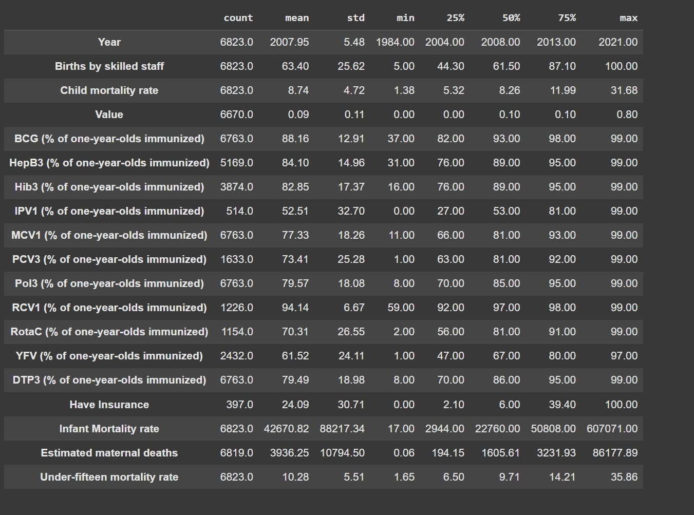

- Leading Causes of various mortality rates

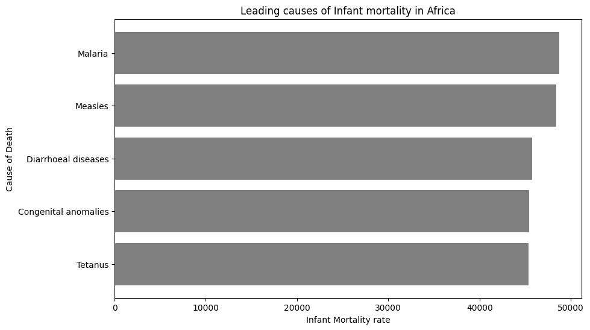

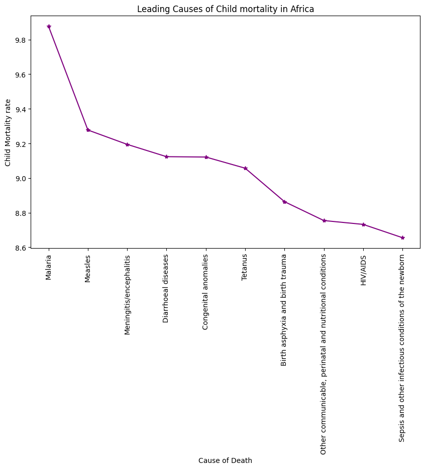

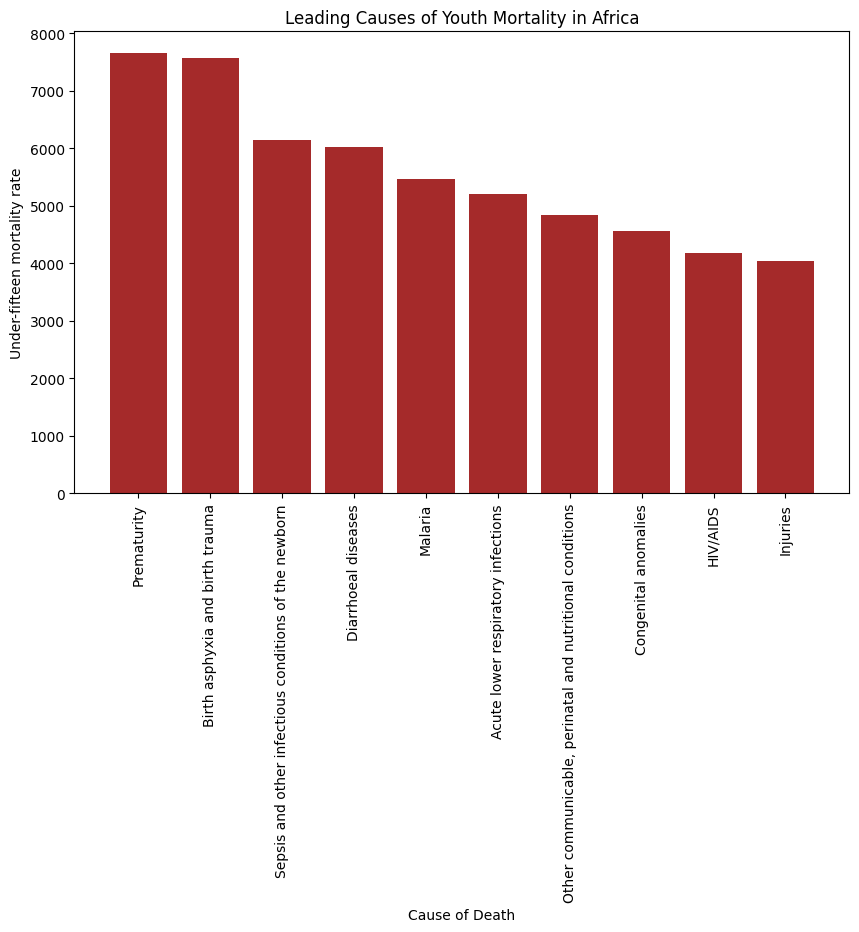

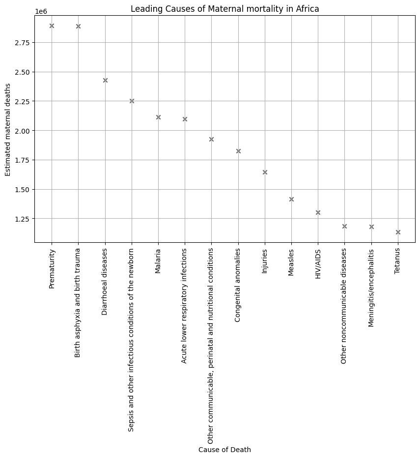

- African Countries by various Mortality rates

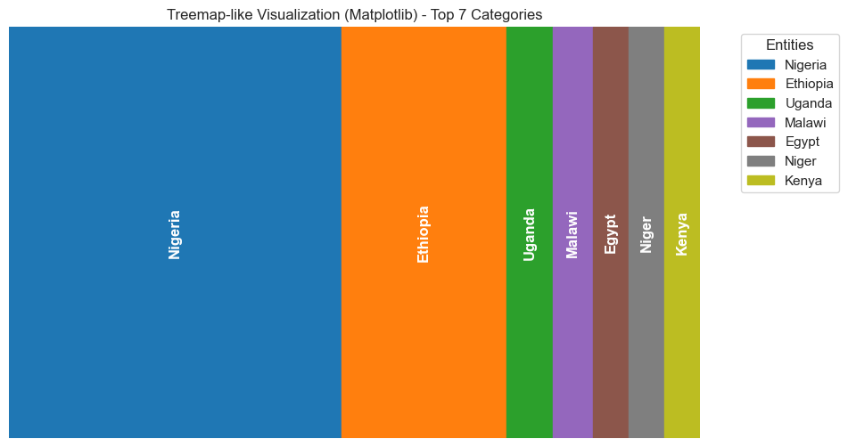

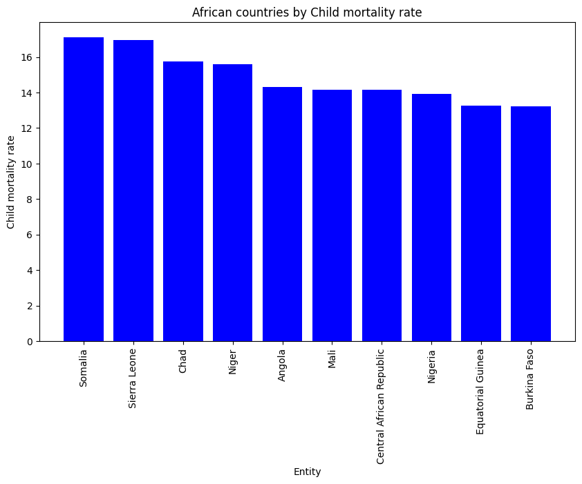

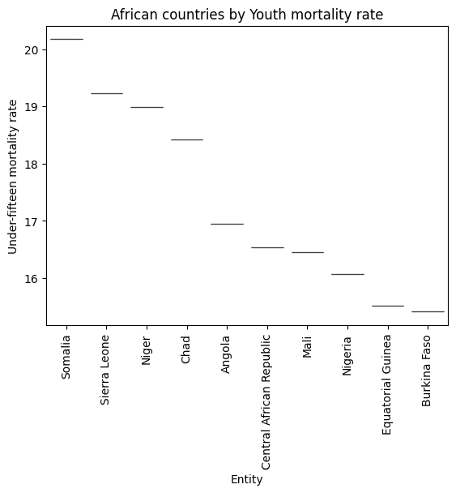

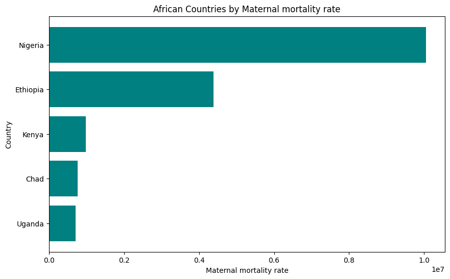

  
- Correlation Heatmap of Infant Immunization rates

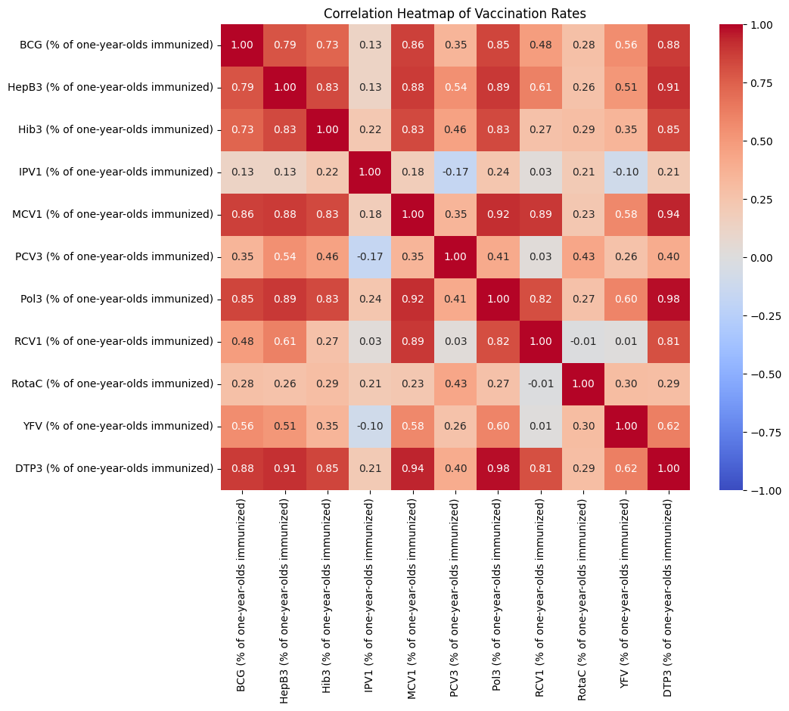

- Subplots of Pairplots showing the paired relationships between Infant Immunization rates

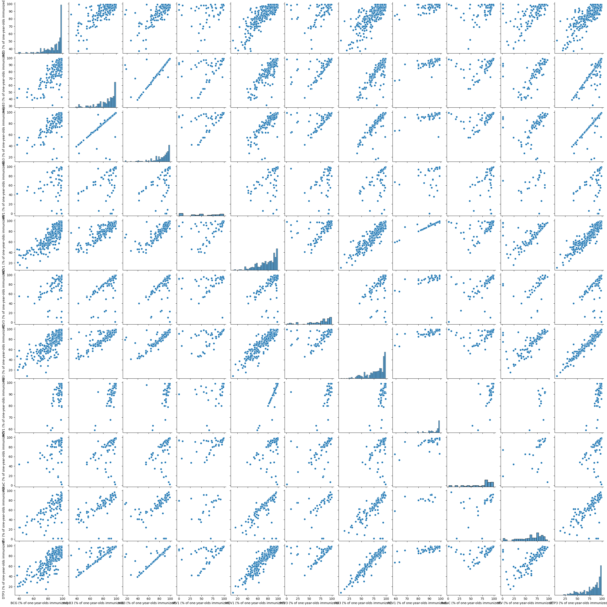

  
- Stacked Column chart of Mean Infant immunization rates by African countries
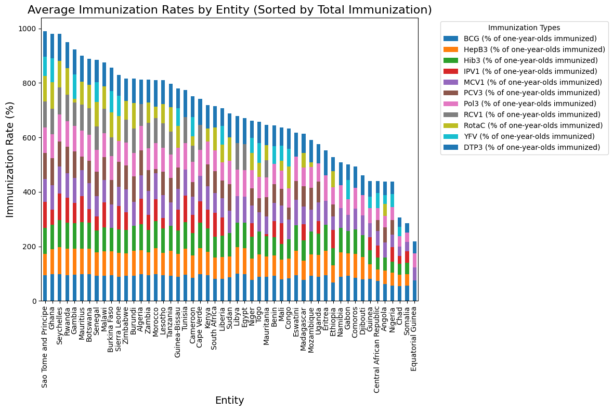

## The Disparities in Mortality Rates and Immunization Coverage Across African Countries

The disparities in infant, child, maternal, and youth mortality rates, as well as immunization coverage across African countries, are influenced by a complex mix of social, economic, healthcare, and political factors. Here are reasons why each of these patterns holds true:

### 1. **Infant Mortality Rate in Nigeria, Ethiopia, Uganda, Malawi, and Egypt**
- **Nigeria**: Nigeria has the highest population in Africa, and large sections of its population live in poverty, particularly in rural areas. Lack of access to quality healthcare, inadequate infrastructure, high rates of malnutrition, and limited maternal care all contribute to its high infant mortality rate. Infectious diseases like pneumonia, diarrhea, and malaria are prevalent, and access to vaccines and health services is often inadequate, especially in remote areas.
- **Ethiopia**: While Ethiopia has made significant strides in improving health outcomes, it still faces challenges like poor healthcare infrastructure, poverty, limited access to clean water and sanitation, and a high burden of infectious diseases. Rural areas remain under-served, contributing to higher infant mortality rates.
- **Uganda**: Uganda’s infant mortality rate is high due to challenges like poverty, limited healthcare access, and the prevalence of infectious diseases like malaria and HIV/AIDS. The healthcare system struggles to provide adequate maternal and child care, and nutrition is a concern.
- **Malawi**: Malawi, like many other low-income countries, struggles with limited healthcare access, inadequate maternal care, high rates of malnutrition, and the prevalence of diseases such as malaria. These factors increase the risk of infant deaths, especially in rural areas.
- **Egypt**: Although Egypt has a relatively higher standard of living and better healthcare compared to some other African nations, its infant mortality rate remains relatively high due to inequalities in access to healthcare, particularly in rural and impoverished areas. Additionally, factors such as malnutrition and chronic diseases like anemia in pregnant women contribute to infant mortality.

### 2. **Child Mortality Rate in Somalia, Sierra Leone, Chad, Niger, and Angola**
- **Somalia**: Somalia’s child mortality rate is one of the highest in the world due to ongoing conflict, lack of infrastructure, and political instability. The country suffers from chronic food insecurity, frequent droughts, and limited access to healthcare services, which all contribute to high rates of childhood deaths, especially from preventable causes like malnutrition and diarrhea.
- **Sierra Leone**: Sierra Leone, still recovering from the civil war and the Ebola epidemic, has a very weak healthcare system, poor infrastructure, and high poverty rates. Limited access to healthcare, malnutrition, and infectious diseases, such as malaria and pneumonia, significantly contribute to the country’s high child mortality rate.
- **Chad**: Chad is one of the poorest countries in Africa with limited access to healthcare and a high prevalence of infectious diseases. Malnutrition, lack of access to clean water, and inadequate immunization coverage result in high childhood mortality rates.
- **Niger**: Niger faces extreme poverty, limited healthcare access, high levels of malnutrition, and inadequate infrastructure. The country is prone to food insecurity due to recurrent droughts, which negatively impact child survival rates.
- **Angola**: Despite significant oil wealth, Angola has a high child mortality rate due to inadequate healthcare systems, poor sanitation, high rates of malnutrition, and a lack of access to vaccines and essential treatments for children. Angola also faces high rates of maternal mortality, which directly impacts child survival.

### 3. **Youth Mortality**
Youth mortality is often lower than that of infants or children because by the time individuals reach adolescence, they have survived many of the most critical risks associated with younger age groups, such as infectious diseases, malnutrition, and complications from childbirth. However, youth mortality is still impacted by factors like:
- **Accidents and injuries**: Youth are more prone to road traffic accidents, violence, and other injuries.
- **HIV/AIDS**: In some countries, HIV/AIDS continues to be a significant cause of death among adolescents, especially in sub-Saharan Africa.
- **Violence and conflict**: Armed conflicts in countries like Somalia and South Sudan result in the death of young people, especially in war zones.

### 4. **Maternal Mortality in Nigeria, Ethiopia, Kenya, Chad, and Uganda**
- **Nigeria**: Nigeria has one of the highest maternal mortality rates in the world due to insufficient maternal healthcare services, lack of skilled birth attendants, high rates of teenage pregnancy, poor nutrition, and complications like hemorrhage and sepsis. Access to healthcare is especially limited in rural areas.
- **Ethiopia**: Despite significant progress in maternal healthcare, Ethiopia still struggles with high maternal mortality rates. Factors such as limited access to skilled birth attendants, lack of family planning, and high rates of adolescent pregnancies contribute to maternal deaths.
- **Kenya**: Kenya faces challenges such as inadequate access to quality healthcare, poor maternal education, and insufficient family planning services. Maternal deaths often result from complications like hemorrhage, hypertensive disorders, and infections. Rural areas are particularly underserved.
- **Chad**: Chad’s maternal mortality rate is high due to lack of access to healthcare, particularly in rural areas. Many women deliver without the presence of skilled attendants, and conditions like obstructed labor, hemorrhage, and sepsis often result in maternal deaths.
- **Uganda**: Uganda’s maternal mortality rate remains high due to limited access to healthcare facilities, especially in rural regions, insufficient skilled birth attendants, and inadequate prenatal and postnatal care. Cultural practices and early marriages also contribute to maternal deaths.

### 5. **Trends in Mortality**
- **Infant Mortality vs. Youth Mortality**: Infant mortality is typically higher than youth mortality for several reasons. Infants are more vulnerable due to their underdeveloped immune systems, susceptibility to diseases like pneumonia, malaria, and diarrhea, and complications during childbirth. Youth mortality tends to be lower because most children survive the critical early years, and although they face risks from injuries, diseases like HIV, and violence, these risks are not as widespread across the entire population.

### 6. **Immunization Rates**
- **High Immunization Rates in Ghana, Seychelles, Rwanda, Gambia, and Sao Tome & Principe**: These countries have made substantial investments in healthcare infrastructure, vaccination programs, and public health campaigns. For example:
  - Rwanda has been praised for its successful health programs, including high immunization rates, due to a strong health system, government commitment, and international support.
  - Seychelles has small populations and better healthcare systems, which allow for more effective immunization coverage.
  - Ghana has had significant progress in its vaccination campaigns, supported by international organizations like GAVI and a relatively strong healthcare infrastructure.
- **Low Immunization Rates in Nigeria, Chad, Somalia, and Equatorial Guinea**: These countries face challenges such as political instability, conflict, weak healthcare systems, and poor infrastructure. For example:
  - Nigeria has large rural areas where access to healthcare is limited, leading to lower immunization coverage.
  - Somalia suffers from ongoing conflict, which disrupts healthcare delivery and immunization programs.
  - Chad and Equatorial Guinea have similarly weak health systems and logistical barriers that prevent widespread vaccination coverage.

---

## Solutions to Address Mortality and Immunization Issues

Addressing the high mortality rates (infant, child, maternal, and youth) and improving immunization coverage in African countries requires a comprehensive, multi-faceted approach. Solutions must target the root causes of these issues, including poverty, inadequate healthcare infrastructure, political instability, and lack of education, while considering the unique challenges of each country. Below are key solutions that can help address these problems:

### 1. **Strengthening Healthcare Systems**
- **Expand Access to Primary Healthcare**: Ensure that basic healthcare services, including immunizations, prenatal and postnatal care, and treatment for common childhood diseases, are available to all populations, particularly in rural and underserved areas. This can be done by building more health centers, improving transportation to healthcare facilities, and recruiting and training healthcare workers.
- **Increase Investment in Health Infrastructure**: Governments and international organizations should invest in building and upgrading healthcare infrastructure (hospitals, clinics, and laboratories) and ensuring they are equipped with the necessary tools, medications, and medical supplies. This includes improving electricity and water supply in healthcare facilities.
- **Skilled Healthcare Workforce**: Invest in training more healthcare professionals (doctors, nurses, midwives) and provide incentives to retain them, particularly in rural and remote areas. Increasing the number of skilled birth attendants is crucial for reducing maternal and infant mortality.
- **Emergency Medical Services**: Improve emergency medical services and maternal transportation systems to reduce maternal deaths due to complications during childbirth.

### 2. **Improving Maternal Health**
- **Universal Access to Family Planning**: Provide access to modern contraceptives and family planning education to reduce unintended pregnancies, particularly among adolescents. Reducing teenage pregnancies can prevent complications during childbirth and help improve maternal health.
- **Quality Antenatal Care**: Ensure that pregnant women have access to regular, quality antenatal care. This includes monitoring for conditions such as preeclampsia, anemia, and malnutrition, as well as providing necessary vaccines and micronutrient supplements (e.g., folic acid, iron).
- **Postnatal Care**: Focus on postnatal care to monitor the health of both mothers and babies after birth. Early detection of health problems, especially infections, is critical.
- **Community Health Workers (CHWs)**: Train and deploy community health workers to educate communities about maternal health, hygiene, and the importance of seeking healthcare during pregnancy and childbirth.

### 3. **Improving Child Health**
- **Nutrition Programs**: Combat malnutrition by providing supplementary feeding programs, especially for pregnant women and young children. Mal

nutrition is a leading cause of infant and child mortality. Addressing issues like stunting, micronutrient deficiencies (such as vitamin A and iron), and protein-energy malnutrition can reduce child deaths.
- **Vaccination Campaigns**: Scale up immunization programs to ensure that all children receive essential vaccines (e.g., measles, polio, diphtheria, tuberculosis, and tetanus). Innovative delivery methods, such as mobile vaccination clinics or outreach programs, can help reach remote areas.
- **Treatment of Common Diseases**: Provide affordable and accessible treatments for common childhood diseases such as diarrhea, malaria, pneumonia, and respiratory infections. This includes promoting oral rehydration salts (ORS) for diarrhea and improving access to antimalarial drugs.
- **Early Childhood Development Programs**: Invest in early childhood development (ECD) programs to improve the health and well-being of children through nutrition, education, and access to healthcare.

### 4. **Addressing HIV/AIDS and Infectious Diseases**
- **HIV Prevention and Treatment**: Continue to scale up efforts to prevent the transmission of HIV, particularly from mother to child. Access to antiretroviral therapy (ART) should be expanded to reduce the burden of HIV-related deaths among mothers and children.
- **Malaria Control**: Implement widespread malaria control programs, such as insecticide-treated bed nets, indoor spraying, and prompt treatment with artemisinin-based combination therapy (ACTs). Reducing malaria deaths among children and pregnant women will significantly improve health outcomes.
- **Improved Sanitation and Clean Water**: Improving access to clean water and sanitation can help reduce the spread of diseases like cholera, diarrhea, and typhoid fever, which are major causes of childhood deaths.

### 5. **Health Education and Awareness**
- **Community-Based Health Education**: Raise awareness about the importance of immunization, hygiene, prenatal care, and the danger signs during pregnancy and childbirth. Use local languages and community-based platforms (e.g., radio, community meetings) to spread health messages.
- **Address Cultural Barriers**: Work with community leaders and influencers to challenge harmful cultural practices (e.g., early marriages, female genital mutilation) that contribute to high maternal and child mortality. Community engagement is critical for changing behaviors and improving health outcomes.
- **Public Health Campaigns**: Launch national campaigns to promote healthy behaviors, such as breastfeeding, vaccination, sanitation, and seeking timely medical care. Focus on both urban and rural populations.

### 6. **Strengthening Health Financing**
- **Government Funding for Health**: Governments must prioritize healthcare in their national budgets. Increased public spending on health systems can lead to improved access to services, better healthcare infrastructure, and the hiring of skilled health workers.
- **Donor Funding and Partnerships**: Engage international organizations (e.g., WHO, UNICEF, GAVI, the Global Fund) to fund critical health programs, including vaccination campaigns, maternal and child health initiatives, and emergency response to health crises.
- **Health Insurance**: Expand the coverage of health insurance schemes to reduce the financial barriers to accessing healthcare services. This will ensure that vulnerable populations, including those in rural areas, can afford necessary treatments.

### 7. **Improving Immunization Rates**
- **Mobile Health Clinics**: Use mobile vaccination units to reach remote areas where healthcare access is limited. Mobile clinics can help deliver immunizations, especially in rural or conflict-affected regions.
- **Improve Vaccine Supply Chains**: Strengthen vaccine distribution systems to ensure that vaccines are consistently available in health facilities across the country. Cold chain systems must be improved to preserve vaccine potency.
- **Collaboration with NGOs**: Work with non-governmental organizations (NGOs) to organize large-scale immunization drives, which can increase coverage in hard-to-reach areas.
- **Public-Private Partnerships**: Engage the private sector in the delivery of vaccines and healthcare services. Public-private partnerships can expand reach and improve logistics for vaccine distribution.

### 8. **Tackling Political and Economic Stability**
- **Good Governance and Accountability**: Strengthen governance structures to ensure that healthcare resources are used efficiently and transparently. Address corruption and mismanagement in health programs.
- **Political Stability**: Political stability is crucial for the effective implementation of health programs. Governments should work to reduce conflict and foster peace to ensure that healthcare services can be delivered without disruption.
- **Economic Development**: Sustainable economic growth, job creation, and poverty reduction are fundamental to improving health outcomes. Reducing poverty can improve access to nutrition, education, and healthcare, leading to better health outcomes for infants, children, and mothers.

### 9. **Addressing Gender Inequality**
- **Empower Women**: Improve access to education, economic opportunities, and healthcare for women. Empowering women helps reduce maternal mortality, improve child health, and increase immunization rates.
- **Combat Gender-Based Violence**: Gender-based violence (GBV) is a major barrier to women’s health. Programs should focus on preventing GBV and providing support services to survivors, as GBV has direct health consequences, including complications during pregnancy and childbirth.

## Conclusion:
The solutions to the health challenges facing many African countries are complex and require coordinated efforts from governments, international organizations, local communities, and the private sector. While progress has been made in some areas, addressing issues like high mortality rates, inadequate healthcare access, and low immunization coverage requires a sustained, multi-pronged approach that focuses on healthcare infrastructure, education, economic development, and social empowerment. By strengthening healthcare systems, improving maternal and child health, expanding immunization coverage, and addressing the root causes of poverty and inequality, African countries can significantly reduce mortality rates and improve overall health outcomes for their populations.

#### APPRECIATION  
Special thanks to [Mr Dayo Dada](https://github.com/Deewhy254) and the Regonet Team for all the new things they taught me while taking the Data Analytics course with them.  
I also want to thank you for taking your time to go through this project.

#### Author
[Etebom Ntuk](https://github.com/netebom)  

